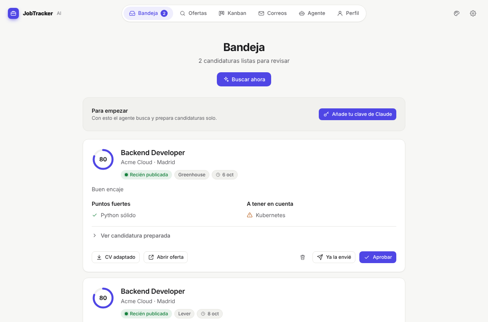
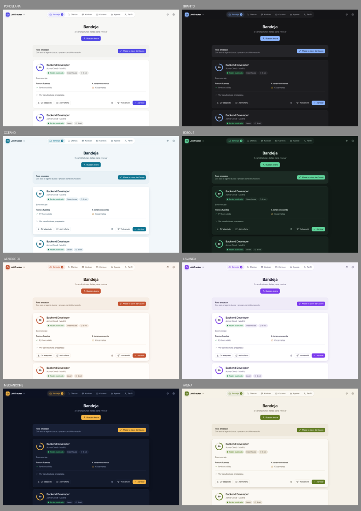

# 💼 JobTracker AI

Asistente local (pensado para macOS) que automatiza la búsqueda de empleo con IA:
analiza tu CV, calcula la compatibilidad con cada oferta, te dice si aún estás a
tiempo de aplicar, reescribe tus viñetas para el ATS, redacta cartas de presentación
y clasifica los correos de las empresas en un tablero Kanban.

Desde la 0.3.0 incluye un **agente que busca ofertas solo** y te deja las mejores
candidaturas preparadas (CV en PDF adaptado, carta y respuestas) en una **Bandeja** para
que solo tengas que aprobarlas.

## El agente de búsqueda

```
Fuentes ──► duplicados ──► filtros duros ──► criba rápida ──► análisis completo ──► candidatura ──► 📥 Bandeja
(ATS,        (gratis)       (gratis: puesto,   (Claude Haiku,    (Claude Opus, solo   (PDF, carta,      (tú apruebas,
 portales,                   ubicación,         por lotes, CV     las N mejores por    respuestas)        envías o descartas
 alertas)                    salario…)          en caché)         encaje + urgencia)                      con motivo)
```

- **Cuándo**: cada 3 h en segundo plano (LaunchAgent), aunque la app esté cerrada, o con «🔎 Buscar ahora».
- **Fuentes**: Greenhouse, Lever y Ashby (APIs públicas por empresa), Remotive, Adzuna (API key gratuita)
  y tus **alertas de empleo por correo** (LinkedIn, InfoJobs, Indeed…). LinkedIn no se rasca ni se automatiza:
  su acuerdo de usuario lo prohíbe; leer las alertas que ya recibes es la vía segura.
- **Sin configurar nada**: la primera vez deduce de tu CV ubicación, búsquedas y exclusiones (con Claude Haiku),
  y al subir el CV en la app instalada lanza la primera búsqueda al momento. Todo es editable en 🤖 Agente.
- **Aprende**: los motivos con los que descartas candidaturas se tienen en cuenta en las siguientes cribas.
- **Honesto**: el CV adaptado solo reordena y reformula lo que ya está en tu CV; las preguntas de filtro
  sin respuesta base quedan pendientes en vez de inventarse.
- **Barato**: por defecto usa el perfil **Económico** (Claude Haiku en todo, ≈ 0,50 $/mes con uso normal);
  en Ajustes puedes pasar a Equilibrado (≈ 5 $) o Máxima calidad (≈ 12 $). La criba usa el perfil en caché.
- Nada entra al Kanban ni se envía sin tu aprobación.



Es una **aplicación de escritorio para Mac** (ventana nativa, no el navegador) con interfaz minimalista,
animaciones sutiles y **8 temas** de color, más uno automático que sigue el modo claro/oscuro de macOS:



## Instalar en tu Mac (usuarios)

```bash
curl -fsSL https://github.com/Niick-pixel/Job/releases/latest/download/install.sh | bash
```

…o descarga `JobTrackerAI-X.Y.Z.pkg` desde [Releases](https://github.com/Niick-pixel/Job/releases) y ábrelo.
Después, abre **JobTracker AI** desde Spotlight o `~/Applications`.

- No necesita Homebrew ni permisos de administrador: trae su propio Python (vía [uv](https://github.com/astral-sh/uv)).
- macOS 13+ mostrará el aviso «Ítems en segundo plano añadidos»: son los servicios de la app y el actualizador.
- Si el `.pkg` no está firmado con un Developer ID: clic derecho → Abrir la primera vez.

```bash
jobtracker status                 # versión, servicios y actualizaciones pendientes
jobtracker config api-key         # guarda tu ANTHROPIC_API_KEY (permisos 600)
jobtracker update | rollback      # actualizar ya / volver a la versión anterior
jobtracker config auto-update off # desactivar actualizaciones automáticas
jobtracker config start-at-login on
jobtracker run agent              # ejecuta el agente de búsqueda ahora (en primer plano)
jobtracker logs backend           # backend | updater | agent | desktop
jobtracker uninstall --keep-data
```

## Claves API (Ajustes → Claves API)

Se pegan en la propia app; se guardan en `~/Library/Application Support/JobTrackerAI/.env` con permisos
privados, se aplican al momento y nunca se muestran completas. Cada una tiene un botón «Probar».

| Clave | ¿Necesaria? | Para qué | Cómo conseguirla |
|---|---|---|---|
| **Claude** (`ANTHROPIC_API_KEY`) | Sí | Analizar CV y ofertas, puntuar, cartas, correos | [console.anthropic.com](https://console.anthropic.com/settings/keys) → crea cuenta → *Billing* (pago por uso) → *API Keys* → *Create Key* |
| **Adzuna** (`ADZUNA_APP_ID` + `ADZUNA_APP_KEY`) | No · gratis | Más ofertas (España y 15 países) | [developer.adzuna.com](https://developer.adzuna.com/signup) → regístrate → *Dashboard* → *API Access Details* |
| **Gmail** (fichero JSON OAuth) | No · gratis | Leer respuestas de empresas y alertas de LinkedIn/InfoJobs | [Google Cloud Console](https://console.cloud.google.com/apis/credentials) → proyecto → activa *Gmail API* → pantalla de consentimiento (Externo, tú como usuario de prueba) → ID de cliente OAuth tipo *Aplicación de escritorio* → descarga el JSON y súbelo en Ajustes → Correo |
| Cualquier otra | — | Futuras integraciones | Ajustes → *Otras claves* |

## Actualizaciones OTA

```
 git tag v0.2.1 && git push origin v0.2.1
        │
        ▼  GitHub Actions (.github/workflows/release.yml)
 tests → tarball reproducible → manifest.json firmado (Ed25519) → .pkg + prueba en macOS real → Release
        │
        ▼  cada Mac instalado (LaunchAgent cada 6 h, o botón «Actualizar ahora»)
 manifest → ¿versión > actual? → firma válida con la clave fijada? → descarga → SHA-256
   → extrae en versions/X.Y.Z → venv (se reutiliza si requirements.txt no cambió)
   → health check en puerto aislado → cambio atómico de `current` → reinicio
   → si /health falla tras reiniciar: rollback automático a la versión anterior
```

En disco (`~/Library/Application Support/JobTrackerAI`): `versions/` (se conservan 2), `venvs/`,
`current → versions/X.Y.Z`, y `data/` + `.env`, que **nunca** se tocan al actualizar.

Garantías: no se instala nada sin firma válida (una vez configurada la clave), no hay downgrades
(un manifiesto viejo firmado se ignora), los paquetes con rutas peligrosas o enlaces se rechazan,
y una versión que no arranca nunca llega a activarse.

### Publicar una versión (mantenedores)

1. **Una sola vez**: `python3 scripts/gen_signing_key.py` → commitea `installer/ota_pubkey.txt` y guarda la
   clave privada como secreto `OTA_SIGNING_KEY` del repo (`gh secret set OTA_SIGNING_KEY`).
2. Sube `VERSION`, añade la sección en `CHANGELOG.md` (es lo que verá el usuario en «Novedades»).
3. `git tag vX.Y.Z && git push origin vX.Y.Z`, o en GitHub: **Actions → Release → Run workflow**
   (crea el tag a partir de `VERSION`).

Opcional: firma y notarización del `.pkg` con un Developer ID (`PKG_SIGN_IDENTITY`, `NOTARY_PROFILE`
en `installer/pkg/build_pkg.sh`).

## Desarrollo

```bash
make setup          # instala Python 3.12 (Homebrew), crea .venv e instala dependencias
# edita .env y pon tu ANTHROPIC_API_KEY
make dev            # interfaz → http://localhost:8000 · API → http://localhost:8000/docs
make desktop        # (macOS) la misma interfaz en la ventana nativa
make test           # tests del backend y del instalador (no llaman a la API real)
make release        # genera dist/ localmente · make pkg (solo macOS)
```

## Arquitectura

```
Job/
├── backend/
│   ├── app/
│   │   ├── main.py               # FastAPI: app, CORS, routers
│   │   ├── config.py             # Settings (.env) con pydantic-settings
│   │   ├── database.py           # SQLModel engine (SQLite por defecto, Postgres vía DATABASE_URL)
│   │   ├── models.py             # Tablas: CVProfile, Job, MatchResult, Application, EmailEvent
│   │   ├── schemas.py            # Esquemas de salida estructurada de la IA + contratos API
│   │   ├── agent.py              # `python -m app.agent` (lo lanza launchd cada 3 h)
│   │   ├── routers/
│   │   │   ├── cv.py             # POST /api/cv (subida y análisis)
│   │   │   ├── jobs.py           # ofertas, /match, /optimize
│   │   │   ├── applications.py   # Kanban (board, mover tarjetas)
│   │   │   ├── emails.py         # clasificar / sincronizar bandeja / alertas de entrevista
│   │   │   ├── agent.py          # preferencias, «buscar ahora», historial y embudo
│   │   │   ├── packages.py       # Bandeja de aprobación, PDF, banco de respuestas
│   │   │   └── system.py         # versión y actualización OTA
│   │   └── services/
│   │       ├── llm.py            # Único punto de contacto con Claude (salidas tipadas)
│   │       ├── cv_parser.py      # pdfplumber + perfilado con IA
│   │       ├── job_ingest.py     # texto o URL → oferta estructurada
│   │       ├── matcher.py        # score híbrido IA + cobertura de requisitos
│   │       ├── urgency.py        # filtro de urgencia (reglas deterministas)
│   │       ├── optimizer.py      # viñetas ATS + carta de presentación
│   │       ├── email_classifier.py
│   │       ├── email_sources.py  # bandeja simulada (JSON) o Gmail (OAuth, solo lectura)
│   │       ├── sources.py        # Greenhouse, Lever, Ashby, Remotive, Adzuna, alertas por correo
│   │       ├── agent.py          # embudo: duplicados → filtros → criba → análisis → candidatura
│   │       ├── packages.py       # CV en PDF adaptado, respuestas adaptadas, paquete completo
│   │       └── notify.py         # notificaciones de macOS
│   └── tests/                    # pytest con un LLM falso
├── frontend/web/                 # interfaz (HTML/CSS/JS sin compilación): 8 temas, vistas en assets/js/views
│   └── backend/app/desktop.py    #   …y la ventana nativa de macOS que la muestra (pywebview + WKWebView)
├── installer/
│   ├── install.sh                # instalador one-liner (uv + Python propio)
│   ├── jobtracker.py             # CLI, servicios launchd y motor OTA (solo stdlib)
│   ├── ed25519.py                # verificación de firmas sin dependencias
│   ├── ota_pubkey.txt            # clave pública fijada
│   ├── pkg/                      # .pkg para macOS (build_pkg.sh, postinstall)
│   └── tests/                    # instalación → OTA → manipulación → rollback
├── scripts/  release.py · gen_signing_key.py · setup_mac.sh
├── .github/workflows/            # CI + release (tag vX.Y.Z → OTA)
├── data/samples/                 # CV, oferta y correos de ejemplo
├── VERSION · CHANGELOG.md · requirements.txt · .env.example · Makefile
```

### Flujo

```
CV (PDF/TXT) ─pdfplumber─► texto ─Claude─► CVExtraction ─┐
                                                          ├─► matcher ─► score + fuertes/brechas
Oferta (texto/URL) ─httpx+bs4─► texto ─Claude─► JobExtraction ┘     │
                                  └─► urgency (fecha, nº candidatos)  └─► optimizer ─► viñetas + carta
Correo ─Claude─► EmailClassification ─► mueve la tarjeta del Kanban + alerta si es entrevista
```

### Decisiones de diseño

- **Salidas estructuradas**: cada llamada a Claude devuelve un modelo Pydantic validado
  (`client.beta.messages.parse`), así no hay parseo frágil de JSON.
- **Score híbrido y explicable**: `0.7 × juicio de la IA + 0.3 × % de requisitos obligatorios
  presentes en el CV` (ajustable con `MATCH_LLM_WEIGHT`). La cobertura literal se pasa a la IA
  para que detecte equivalencias (p. ej. Flask ↔ FastAPI).
- **Urgencia sin IA**: reglas transparentes por días desde publicación y saturación
  (≤3 días ideal, ≤7 buena, ≤14 competida, ≤30 tardía, >30 probablemente cerrada).
- **Honestidad en la optimización**: el optimizador nunca inventa experiencia; las keywords
  sin evidencia se listan aparte en `honesty_warnings`.
- **Fallback de seguridad**: las peticiones usan `fallbacks: "default"`; si un clasificador
  de seguridad rechazara una petición, la API la reintenta en el modelo de respaldo recomendado.
- **Gmail opcional**: `EMAIL_MODE=simulated` lee `data/samples/sample_emails.json`.
  Para Gmail real: crea un OAuth Client (Desktop) en Google Cloud Console, habilita Gmail API,
  descarga el JSON a `data/gmail_credentials.json` y pon `EMAIL_MODE=gmail`.

## Variables de entorno

| Variable | Por defecto | Descripción |
|---|---|---|
| `ANTHROPIC_API_KEY` | — | Clave de la API de Claude |
| `LLM_MODEL` | `claude-haiku-5-5` | Modelo principal (perfil económico). Más calidad: `claude-sonnet-5-5`, `claude-opus-5-5` |
| `LLM_EFFORT` | `low` | Profundidad de razonamiento: `low`…`max` |
| `DATABASE_URL` | `sqlite:///./data/jobtracker.db` | Cualquier URL SQLAlchemy (Postgres incluido) |
| `UPLOAD_DIR` | `./data/uploads` | Dónde se guardan los CV originales |
| `MATCH_LLM_WEIGHT` | `0.7` | Peso del juicio de la IA en el score |
| `EMAIL_MODE` | `simulated` | `simulated` o `gmail` |
| `GMAIL_*` | — | Rutas de credenciales/token y consulta de Gmail |
| `LLM_FAST_MODEL` | `claude-haiku-5-5` | Modelo de la criba masiva de ofertas |
| `COST_PROFILE` | `economico` | Perfil de gasto elegido en Ajustes (lo gestiona la app) |
| `ADZUNA_APP_ID` / `ADZUNA_APP_KEY` | — | Credenciales gratuitas de developer.adzuna.com (opcional) |

## API principal

| Método | Ruta | Qué hace |
|---|---|---|
| POST | `/api/cv` | Sube y analiza un CV (multipart `file`) |
| POST | `/api/jobs` | Crea oferta desde `text` o `url` (+ `posted_date`, `applicants_count` opcionales) |
| POST | `/api/jobs/{id}/match?cv_id=` | Compatibilidad, puntos fuertes y brechas |
| POST | `/api/jobs/{id}/optimize?cv_id=` | Viñetas adaptadas + carta |
| GET | `/api/applications/board` | Tablero Kanban |
| PATCH | `/api/applications/{id}` | Mover tarjeta / notas / fecha de entrevista |
| POST | `/api/emails/classify` · `/api/emails/sync` | Clasificar un correo / sincronizar bandeja |
| GET | `/api/emails/alerts` | Invitaciones a entrevista detectadas |
| GET/PUT | `/api/agent/preferences` | Preferencias de búsqueda y fuentes |
| POST | `/api/agent/run` | Ejecuta el agente ahora (en segundo plano) |
| GET | `/api/agent/runs` · `/api/agent/jobs` | Historial de ejecuciones · embudo de ofertas con motivos |
| GET | `/api/packages` | Bandeja: candidaturas preparadas, ordenadas por encaje y urgencia |
| POST | `/api/jobs/{id}/prepare?cv_id=` | Prepara a mano una candidatura |
| POST | `/api/packages/{id}/decision` | `aprobada` · `enviada` · `descartada` (+ motivo) |
| GET | `/api/packages/{id}/cv.pdf` | CV adaptado en PDF |
| GET/PUT | `/api/answers` | Banco de respuestas a preguntas de filtro |

## Próximos pasos sugeridos

1. **Fase 3**: agente que rellena formularios de Greenhouse/Lever/Ashby (Playwright) con captura antes de enviar.
2. **Fase 4**: seguimientos automáticos (borradores en Gmail), eventos de calendario y dossier de entrevista.
3. Panel de embudo: tasa de respuesta por fuente y por versión de CV.
4. Migraciones con Alembic si se pasa a PostgreSQL.
