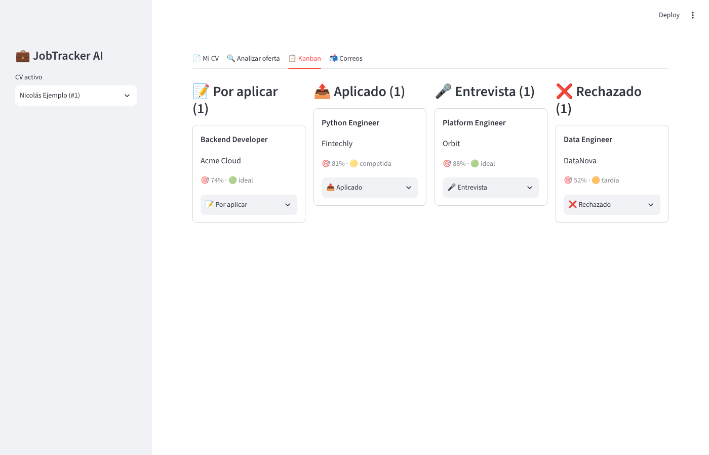

# 💼 JobTracker AI

Asistente local (pensado para macOS) que automatiza la búsqueda de empleo con IA:
analiza tu CV, calcula la compatibilidad con cada oferta, te dice si aún estás a
tiempo de aplicar, reescribe tus viñetas para el ATS, redacta cartas de presentación
y clasifica los correos de las empresas en un tablero Kanban.



## Arranque rápido (Mac)

```bash
make setup          # instala Python 3.12 (Homebrew), crea .venv e instala dependencias
# edita .env y pon tu ANTHROPIC_API_KEY
make dev            # API → http://localhost:8000/docs · UI → http://localhost:8501
make test           # tests (no llaman a la API real)
```

## Arquitectura

```
Job/
├── backend/
│   ├── app/
│   │   ├── main.py               # FastAPI: app, CORS, routers
│   │   ├── config.py             # Settings (.env) con pydantic-settings
│   │   ├── database.py           # SQLModel engine (SQLite por defecto, Postgres vía DATABASE_URL)
│   │   ├── models.py             # Tablas: CVProfile, Job, MatchResult, Application, EmailEvent
│   │   ├── schemas.py            # Esquemas de salida estructurada de la IA + contratos API
│   │   ├── routers/
│   │   │   ├── cv.py             # POST /api/cv (subida y análisis)
│   │   │   ├── jobs.py           # ofertas, /match, /optimize
│   │   │   ├── applications.py   # Kanban (board, mover tarjetas)
│   │   │   └── emails.py         # clasificar / sincronizar bandeja / alertas de entrevista
│   │   └── services/
│   │       ├── llm.py            # Único punto de contacto con Claude (salidas tipadas)
│   │       ├── cv_parser.py      # pdfplumber + perfilado con IA
│   │       ├── job_ingest.py     # texto o URL → oferta estructurada
│   │       ├── matcher.py        # score híbrido IA + cobertura de requisitos
│   │       ├── urgency.py        # filtro de urgencia (reglas deterministas)
│   │       ├── optimizer.py      # viñetas ATS + carta de presentación
│   │       ├── email_classifier.py
│   │       └── email_sources.py  # bandeja simulada (JSON) o Gmail (OAuth, solo lectura)
│   └── tests/                    # pytest con un LLM falso
├── frontend/streamlit_app.py     # UI: CV · Oferta · Kanban · Correos
├── data/samples/                 # CV, oferta y correos de ejemplo
├── scripts/setup_mac.sh
├── requirements.txt · .env.example · Makefile
```

### Flujo

```
CV (PDF/TXT) ─pdfplumber─► texto ─Claude─► CVExtraction ─┐
                                                          ├─► matcher ─► score + fuertes/brechas
Oferta (texto/URL) ─httpx+bs4─► texto ─Claude─► JobExtraction ┘     │
                                  └─► urgency (fecha, nº candidatos)  └─► optimizer ─► viñetas + carta
Correo ─Claude─► EmailClassification ─► mueve la tarjeta del Kanban + alerta si es entrevista
```

### Decisiones de diseño

- **Salidas estructuradas**: cada llamada a Claude devuelve un modelo Pydantic validado
  (`client.beta.messages.parse`), así no hay parseo frágil de JSON.
- **Score híbrido y explicable**: `0.7 × juicio de la IA + 0.3 × % de requisitos obligatorios
  presentes en el CV` (ajustable con `MATCH_LLM_WEIGHT`). La cobertura literal se pasa a la IA
  para que detecte equivalencias (p. ej. Flask ↔ FastAPI).
- **Urgencia sin IA**: reglas transparentes por días desde publicación y saturación
  (≤3 días ideal, ≤7 buena, ≤14 competida, ≤30 tardía, >30 probablemente cerrada).
- **Honestidad en la optimización**: el optimizador nunca inventa experiencia; las keywords
  sin evidencia se listan aparte en `honesty_warnings`.
- **Fallback de seguridad**: las peticiones usan `fallbacks: "default"`; si un clasificador
  de seguridad rechazara una petición, la API la reintenta en el modelo de respaldo recomendado.
- **Gmail opcional**: `EMAIL_MODE=simulated` lee `data/samples/sample_emails.json`.
  Para Gmail real: crea un OAuth Client (Desktop) en Google Cloud Console, habilita Gmail API,
  descarga el JSON a `data/gmail_credentials.json` y pon `EMAIL_MODE=gmail`.

## Variables de entorno

| Variable | Por defecto | Descripción |
|---|---|---|
| `ANTHROPIC_API_KEY` | — | Clave de la API de Claude |
| `LLM_MODEL` | `claude-opus-5-5` | Modelo (`claude-sonnet-5-5` / `claude-haiku-5-5` son más baratos) |
| `LLM_EFFORT` | `medium` | Profundidad de razonamiento: `low`…`max` |
| `DATABASE_URL` | `sqlite:///./data/jobtracker.db` | Cualquier URL SQLAlchemy (Postgres incluido) |
| `UPLOAD_DIR` | `./data/uploads` | Dónde se guardan los CV originales |
| `MATCH_LLM_WEIGHT` | `0.7` | Peso del juicio de la IA en el score |
| `BACKEND_URL` | `http://localhost:8000` | URL de la API para Streamlit |
| `EMAIL_MODE` | `simulated` | `simulated` o `gmail` |
| `GMAIL_*` | — | Rutas de credenciales/token y consulta de Gmail |

## API principal

| Método | Ruta | Qué hace |
|---|---|---|
| POST | `/api/cv` | Sube y analiza un CV (multipart `file`) |
| POST | `/api/jobs` | Crea oferta desde `text` o `url` (+ `posted_date`, `applicants_count` opcionales) |
| POST | `/api/jobs/{id}/match?cv_id=` | Compatibilidad, puntos fuertes y brechas |
| POST | `/api/jobs/{id}/optimize?cv_id=` | Viñetas adaptadas + carta |
| GET | `/api/applications/board` | Tablero Kanban |
| PATCH | `/api/applications/{id}` | Mover tarjeta / notas / fecha de entrevista |
| POST | `/api/emails/classify` · `/api/emails/sync` | Clasificar un correo / sincronizar bandeja |
| GET | `/api/emails/alerts` | Invitaciones a entrevista detectadas |

## Próximos pasos sugeridos

1. Crear eventos de calendario (Google Calendar / `.ics` para Calendar.app) al detectar entrevistas.
2. Notificaciones nativas de macOS (`osascript` / `pync`) y sincronización periódica de Gmail.
3. Exportar el CV optimizado a PDF/DOCX.
4. Migraciones con Alembic al pasar a PostgreSQL.
5. Frontend Next.js con Kanban drag-and-drop cuando la lógica esté estable.
